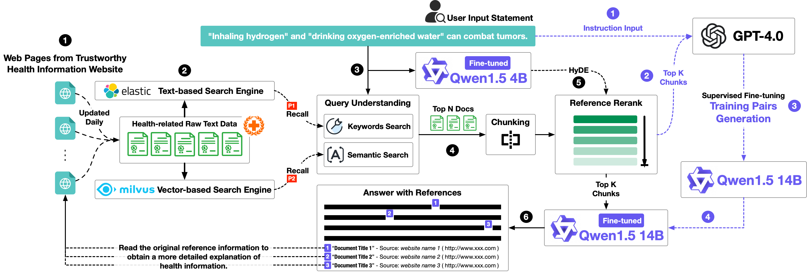
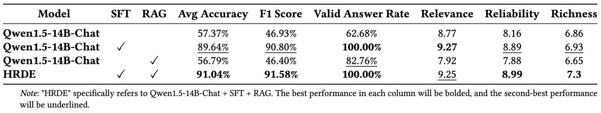
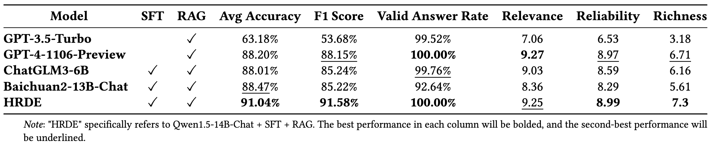
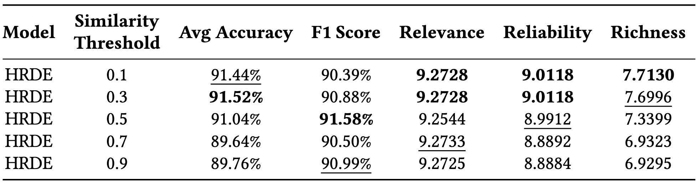

[English](./README.md) | [中文简体](./README.zh_CN.md)

<h1 align="center">
    HRDE
</h1>
<p align="center">Retrieval-Augmented Large Language Models for Chinese Health Rumor Detection and Explainability
<p align="center">
<a href="https://opensource.org/license/apache-2-0/">
    
</a>
<a href="https://github.com/hush-cd/HRDE/issues">
    
</a>
<a href="">
    
</a></p>


## Contents
- [Introduction](#introduction)
- [Project Structure](#project-structure)
- [Get Started](#get-started)
- [Results](#results)
- [Contact Us](#contact-us)
- [Citation](#citation)

## Introduction

As people increasingly prioritize their health, the speed and breadth of health information dissemination on the internet have also grown. At the same time, the presence of false health information (health rumors) intermingled with genuine content poses a significant potential threat to public health. However, current research on Chinese health rumors still lacks a large-scale, public, and open-source dataset of health rumor information, as well as effective and reliable rumor detection methods. We addresses this gap by constructing a dataset containing 1.12 million health-related rumors (HealthRCN) through web scraping of common health-related questions and a series of data processing steps. HealthRCN is the largest known dataset of Chinese health information rumors to date. Based on this dataset, we propose retrieval-augmented large language models for Chinese health rumor detection and explainability (HRDE \footnote{HRDE is currently deployed at \url{http://www.rumors.icu/}.}). This model leverages retrieved relevant information to accurately determine whether the input health information is a rumor and provides explanatory responses, effectively aiding users in verifying the authenticity of health information. In evaluation experiments, we compared multiple models and found that HRDE outperformed them all, including GPT-4-1106-Preview, in rumor detection accuracy and answer quality. HRDE achieved an average accuracy of 91.04\% and an F1 score of 91.58\%. 
<p align="center"></p>

## Project Structure
Here's an overview of the project structure:
```
.
├── assets                        # Stores project assets, such as images, charts, etc.
├── configs                       # Stores configuration files.
├── core                          # Core code library.
│   ├── data_loader.py            # Data loading.
│   ├── es_create.py              # Elasticsearch index creation.
│   ├── milvus_create.py          # Schema creation for Milvus.
│   ├── data_to_es.py             # Import reference documents into Elasticsearch.
│   ├── data_to_milvus.py         # Import reference documents into Milvus.
│   ├── es.py                     # Retrieve reference documents from Elasticsearch.
│   ├── milvus.py                 # Retrieve reference documents from Milvus.
│   ├── reference_data_process.py # Batch import reference documents from ./data/reference_data.
│   ├── embedding_model.py        # Load the embedding model.
│   ├── llm.py                    # LLM invocation.
│   ├── main.py                   # Main function for invoking HRDE.
│   ├── run.py                    # Example of calling main.py.
│   ├── run_api.py                # API interface call for main.py.
│   ├── exprtiment.py             # Evaluation methods.
│   ├── evaluator.py              # Test the model using the evaluation dataset (calls exprtiment.py).
│   ├── evaluator2.py             # Evaluate model responses using GPT-4.
│   ├── similarity_information.py # Retrieve similar rumor titles.
│   └── utils.py                  # Other utility functions.
├── api_server.py                 # API service deployment.
├── data                          # Stores various datasets.
│   ├── reference_data            # Raw data for reference documents (few examples).
│   ├── dev_data                  # Evaluation dataset.
│   └── sft_data                  # Fine-tuning dataset.
├── prompts                       # Stores various prompt templates for LLMs.
├── outputs                       # Stores experimental result files.
└── stopwords                     # Stores text files of stop words.
```

## Get Started
1. Clone the repository
   * `git clone https://github.com/`
2. Prepare the environment
   * `conda create -n grimoire python=3.8.18`
   * `conda activate grimoire`
3. Install Python dependencies and load the Embedding model
   * `pip install -r requirements.txt`
   * `python ./core/embedding_model.py    `
4. Configuration
   * Database configuration
     * Complete the deployment of Elasticsearch and Milvus
     * Complete the configuration of Elasticsearch and Milvus in [configs/es.yaml](configs/es.yaml)  and [configs/milvus.yaml ](configs/milvus.yaml) .
     * Refer to [es_create.py](core/es_create.py) and [milvus_create.py](core/milvus_create.py) to build the corresponding databases.
     * Refer to [reference_data_process.py](core/reference_data_process.py) to import the raw reference document data into both databases.
   * LLMs configuration
     * Configure LLMs in [configs/llm.yaml](configs/llm.yaml) .
5. Check [main.py](main.py) and [run.py](run.py) to understand how to use the HRDE main function.

## Results
<p align="center"></p>
<p align="center"></p>

<p align="center"></p>


## Contact Us

For any questions, feedback, or suggestions, please open a GitHub Issue. You can reach out through [GitHub Issues](https://github.com/hush-cd/HRDE/issues).

## Citation
```

```