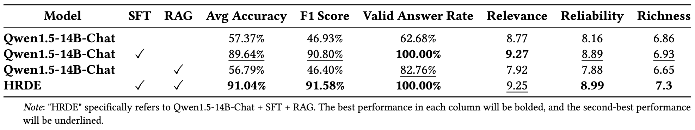

[English](./README.md) | [中文简体](./README.zh_CN.md)

<h1 align="center">
    HRDE
</h1>
<p align="center">Retrieval-Augmented Large Language Models for Chinese Health Rumor Detection and Explainability
<p align="center">
<a href="https://opensource.org/license/apache-2-0/">
    
</a>
<a href="https://github.com/hush-cd/HRDE/issues">
    
</a>
<a href="https://arxiv.org/abs/2407.00668">
    
</a></p>


## 目录
- [介绍](#介绍)
- [项目结构](#项目结构)
- [快速开始](#快速开始)
- [实验结果](#实验结果)
- [数据获取](#数据获取)
- [联系我们](#联系我们)
- [引用](#引用)

## 介绍

随着人们对健康的重视程度增加，网络上的健康信息传播速度与范围也随之增大。因此，虚假类健康信息（健康谣言）造成的负面影响已不容忽视。然而，当前针对中文健康谣言的研究仍缺乏一个大规模的、公共的、开源的健康谣言信息数据集，以及有效可靠的谣言检测方法。我们通过对常见健康相关问题的网络爬取和一系列数据处理步骤，构建了一个包含112万条健康相关谣言的数据集（HealthRCN），以填补这一空白。HealthRCN是迄今为止已知的最大的中文健康信息谣言数据集。基于该数据集，我们提出了用于中文健康谣言检测和解释的检索增强大语言模型（[HRDE](http://www.rumors.icu/)）。该模型利用检索到的相关信息准确判断输入的健康信息是否为谣言，并提供解释性回答，有效帮助用户验证健康信息的真实性。在评估实验中，我们比较了多个模型，发现HRDE在谣言检测准确性和回答质量方面均优于其他模型，包括GPT-4-1106-Preview。HRDE谣言识别的平均准确率为91.04%，F1得分为91.58%。
<p align="center"></p>

## 项目结构
该项目结构包括几个关键模块。以下是项目结构的概览：
```
.
├── assets                        # 存储项目素材，例如图像、图表等。
├── configs                       # 存储配置文件。
├── core                          # 核心代码库。
│   ├── data_loader.py            # 数据加载。
│   ├── es_create.py              # Elasticsearch 索引创建
│   ├── milvus_create.py          # Milvus 的 schema 创建
│   ├── data_to_es.py             # 参考文档导入 Elasticsearch
│   ├── data_to_milvus.py         # 参考文档导入 Milvus
│   ├── es.py                     # 从 Elasticsearch 检索参考文档
│   ├── milvus.py                 # 从 Milvus 检索参考文档
│   ├── reference_data_process.py # 批量导入./data/reference_data中的参考文档
│   ├── embedding_model.py        # 加载 Embedding model
│   ├── llm.py                    # LLM 调用
│   ├── main.py                   # 调用 HRDE 的主函数
│   ├── run.py                    # main.py 的调用示例
│   ├── run_api.py                # main.py 的 api 接口调用
│   ├── exprtiment.py             # 评测方法
│   ├── evaluator.py              # 使用评估数据集对模型进行测试（调用 exprtiment.py）
│   ├── evaluator2.py             # 使用 GPT-4 对模型回答评分
│   ├── similarity_information.py # 相似谣言标题检索
│   └── utils.py                  # 其他工具函数
├── api_server.py                 # Api 服务部署
├── data                          # 存储各类数据集。
│   ├── reference_data            # 参考文档的原始数据（少数样例）。
│   ├── dev_data                  # 评估数据集。
│   └── sft_data                  # 微调数据集。
├── prompts                       # 存储各类输入给 LLMs 的 prompt 模板。
├── outputs                       # 存储实验结果文件。
└── stopwords                     # 存储停用词的文本文件。
```

## 快速开始
1. 克隆仓库
   * `git clone https://github.com/`
2. 准备环境
   * `conda create -n grimoire python=3.8.18`
   * `conda activate grimoire`
3. 安装 Python 依赖项，并加载 Embedding 模型
   * `pip install -r requirements.txt`
   * `python ./core/embedding_model.py    `
4. 配置
   * 数据库配置
     * 完成 Elasticsearch 和 Milvus 的部署
     * 在 [configs/es.yaml](configs/es.yaml) 和 [configs/milvus.yaml ](configs/milvus.yaml) 中完成 Elasticsearch 和 Milvus 的配置。
     * 参考 [es_create.py](core/es_create.py) 和 [milvus_create.py](core/milvus_create.py) 构建对应的数据库。
     * 参考 [reference_data_process.py](core/reference_data_process.py) 将原始的参考文档数据导入两个数据库。
   * LLMs 配置
     * 在 [configs/llm.yaml](configs/llm.yaml) 中配置 LLMS。
5. 查看 [main.py](main.py) 和 [run.py](run.py) 来了解如何使用 HRDE 主函数。

## 实验结果
<p align="center"></p>
<p align="center"></p>
<p align="center"></p>

## 数据获取
1. 模型微调以及评估数据集: [data/sft_data](https://github.com/hush-cd/HRDE/tree/main/data/sft_data)、[data/dev_data](https://github.com/hush-cd/HRDE/tree/main/data/dev_data).
2. 参考文档数据集：[data/reference_data](https://github.com/hush-cd/HRDE/tree/main/data/reference_date)
3. HealthRCN 数据集：[HealthRCN](https://huggingface.co/datasets/Hush-cd/HealthRCN)


## 联系我们
如有任何问题、反馈或建议，请打开 GitHub Issue。您可以通过 [GitHub Issues](https://github.com/hush-cd/HRDE/issues) 联系我们。

## 引用
```
@misc{chen2024hrderetrievalaugmentedlargelanguage,
      title={HRDE: Retrieval-Augmented Large Language Models for Chinese Health Rumor Detection and Explainability}, 
      author={Yanfang Chen and Ding Chen and Shichao Song and Simin Niu and Hanyu Wang and Zeyun Tang and Feiyu Xiong and Zhiyu Li},
      year={2024},
      eprint={2407.00668},
      archivePrefix={arXiv},
      primaryClass={cs.CL},
      url={https://arxiv.org/abs/2407.00668}, 
}
```
